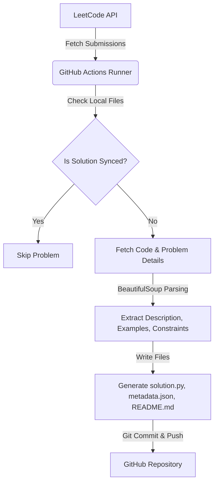

# LeetCode Sync Bot

An automated tool that syncs your accepted LeetCode submissions to a structured GitHub repository. 

Whenever you solve a problem and it is accepted on LeetCode, this bot will:
- Fetch the details of your latest accepted submissions.
- Create a structured folder in your repository categorized by difficulty (`Easy/`, `Medium/`, `Hard/`).
- Generate a clean `solution.py` (or other language extensions) with your code.
- Create a `metadata.json` file storing problem details, URL, and tags.
- Generate a beautiful, readable `README.md` for each problem containing the description, examples, constraints, and your code.
- Commit and push everything automatically to your GitHub profile using GitHub Actions.

---

## Features

- [x] **Automatic LeetCode Sync:** Periodically scans your recent submissions and imports new accepted solutions.
- [x] **GitHub Actions Automation:** Works entirely in the cloud. No local server or active computer required.
- [x] **Auto README Generation:** Converts problem descriptions, examples, and constraints into formatted markdown files automatically.
- [x] **Metadata Generation:** Keeps structured JSON data for each solution, enabling clean tracking and easy parsing.
- [x] **Difficulty-wise Folder Structure:** Categorizes solutions under `Easy/`, `Medium/`, and `Hard/` at the root directory.
- [x] **Multi-language Support:** Detects the language of your LeetCode submission (Python, C++, Java, etc.) and uses correct file extensions and comment formats.
- [x] **Duplicate Detection:** Prevents duplicate folder creation or API requests by comparing with existing local files.
- [x] **Zero Manual Git Push:** Keeps your GitHub green contribution graph active without any manual intervention.

---

## Folder Structure

The repository maintains the following clean structure at the root level:

```text
leetcode-solutions/
│
├── .github/
│   └── workflows/
│       └── sync.yml          # GitHub Actions workflow script
│
├── scripts/
│   ├── api.py                # LeetCode GraphQL API query module
│   ├── sync.py               # Main synchronization and parsing logic
│   ├── readme_generator.py   # Problem README markdown rendering logic
│   └── main.py               # Entry point of the sync script
│
├── templates/
│   ├── problem_readme.md     # Template for individual problem documentation
│   └── main_readme.md        # Placeholder for root catalog dashboard
│
├── config.json               # Sync configuration settings
├── requirements.txt          # Python dependencies
└── README.md                 # Project documentation (this file)
```

- **`.github/workflows/`**: Contains the automation configuration that triggers the sync.
- **`scripts/`**: Holds the modular Python codebase.
- **`templates/`**: Contains the markdown layout templates used to construct documentation.
- **`Easy/` / `Medium/` / `Hard/`**: Direct root folders housing the synced LeetCode solutions.

---

## Prerequisites

Before setting up the repository, make sure you have the following ready:
1. A **GitHub account** to host your sync repository.
2. A **LeetCode account** (active session cookies are required to pull submissions).
3. **Python 3.13+** installed (if you want to test and run the scripts locally).
4. **Git** installed on your system.

---

## Installation Guide (Very Detailed)

Follow these steps from scratch to set up your automatic synchronization repository.

### Step 1: Fork or Clone this Repository
Fork this repository directly to your GitHub account by clicking the **Fork** button at the top right of this page, or clone it using your terminal.

### Step 2: Clean Existing Solutions

> [!WARNING]
> This repository contains the owner's personal LeetCode solutions inside the `Easy/`, `Medium/`, and `Hard/` folders.
> 
> You **must delete** these folders from your repository root before running the bot for the first time. This ensures your repository starts fresh and only synchronizes your own solutions.

Delete these folders:
- `Easy/`
- `Medium/`
- `Hard/`

### Step 3: Clone your Repository Locally
Clone your new repository to your local machine (replace `your-username` with your actual GitHub username):

```bash
git clone https://github.com/your-username/leetcode-solutions.git
cd leetcode-solutions
```

### Step 4: Create a Python Virtual Environment
Navigate to your repository directory and create a virtual environment to manage dependencies:

**On Windows (PowerShell):**
```powershell
python -m venv venv
.\venv\Scripts\Activate.ps1
```

**On Linux / macOS:**
```bash
python3 -m venv venv
source venv/bin/activate
```

### Step 5: Install Requirements
Install the required packages using pip:

```bash
pip install -r requirements.txt
```

### Step 6: Configure `config.json`
Open the `config.json` file in the root of the repository and configure it with your settings:

```json
{
  "leetcode": {
    "username": "YourLeetCodeUsername"
  },
  "github": {
    "repository": "your-github-username/leetcode-solutions"
  }
}
```

- Replace `"YourLeetCodeUsername"` with your actual LeetCode profile username.
- Replace `"your-github-username/leetcode-solutions"` with the path to your GitHub repository.

### Step 7: Generate GitHub Personal Access Token (PAT)
The GitHub Actions workflow requires a token to push commits back to your repository. 

1. Go to your GitHub **Settings** > **Developer Settings** > **Personal Access Tokens** > **Tokens (classic)**.
2. Click **Generate new token** (classic).
3. Set a name (e.g., `leetcode-sync-token`).
4. Select the **`repo`** scope (full control of private/public repositories).
5. Click **Generate token** and copy it safely.

> [!IMPORTANT]
> Never share this token publicly or paste it directly in any files. You will only paste this token inside the GitHub Secrets settings as described in Step 9.

### Step 8: Retrieve LeetCode Cookies
To authorize the script to pull your private submissions, you must extract session cookies from your browser:

1. Log in to [LeetCode](https://leetcode.com) in your web browser.
2. Press `F12` or right-click and select **Inspect** to open the browser's Developer Tools.
3. Head to the **Network** tab.
4. Refresh the page or click on your profile. Look for any network request targeting `leetcode.com` (such as `/graphql`).
5. Click on the request and look at the **Headers** (or **Cookies**) tab:
   - Find the value of `LEETCODE_SESSION` in the Cookies (it starts with `ey...`).
   - Find the value of `csrftoken` (a 32-character string of letters and numbers).
6. Copy both values safely.

### Step 9: Create GitHub Repository Secrets
Now, you need to add your tokens and cookies as secrets in your GitHub repository:

1. Navigate to your repository on GitHub.
2. Go to **Settings** > **Secrets and variables** > **Actions**.
3. Click **New repository secret** and add the following three secrets:

| Secret Name | Value | Purpose |
| :--- | :--- | :--- |
| `LEETCODE_SESSION` | Paste your LeetCode `LEETCODE_SESSION` cookie | Authorizes the script to retrieve your submissions |
| `LEETCODE_CSRF_TOKEN` | Paste your LeetCode `csrftoken` cookie | Bypasses LeetCode CSRF protection |
| `GH_TOKEN` | Paste your GitHub Personal Access Token (PAT) | Authorizes GitHub Actions to commit and push |

### Step 10: Enable GitHub Actions & Run the Workflow
1. Go to the **Actions** tab of your repository.
2. If actions are disabled, click the button to enable them.
3. Click on the **Sync LeetCode Solutions** workflow in the left sidebar.
4. Click the **Run workflow** dropdown on the right and click the green button to trigger it manually.
5. The workflow is also scheduled to run automatically in the background (every 15 minutes by default during development configuration).

---

## How It Works



1. **GitHub Actions** triggers the workflow on a cron schedule or a manual run.
2. The Python sync script queries LeetCode's GraphQL API for the latest submissions of the configured user.
3. The script traverses local files to see if a folder with the zero-padded question ID and title already exists. If yes, it skips to save bandwidth.
4. If a new accepted solution is detected, the script fetches the full question details (including HTML content and topic tags) and the submission source code.
5. The HTML content is parsed using `BeautifulSoup` to divide description text, example testcases, and constraints into separate blocks.
6. A subfolder is created under `Easy/`, `Medium/`, or `Hard/`.
7. `solution.py`, `metadata.json`, and `README.md` are written.
8. Git stages the changes using `git add .`, commits the changes with `chore: sync LeetCode solutions`, and pushes them back to your repository.

---

## Generated Folder Structure Example

Once the bot runs, your folders will be organized like this:

```text
Easy/
└── 0001-Two-Sum/
    ├── solution.py       # Your accepted solution code
    ├── metadata.json     # Problem details & tags
    └── README.md         # Generated markdown sheet
```

### File Explanations:
- **`solution.py`**: Your clean, submitted code file. The file extension matches the language you solved the problem in (e.g., `.cpp`, `.java`, `.py`).
- **`metadata.json`**: Structured representation of problem variables.
- **`README.md`**: Fully-rendered problem dashboard showing the title, difficulty, topics, problem link, description, examples, and constraints along with your formatted solution code block.

---

## `metadata.json`

Each problem contains a `metadata.json` that acts as the single source of truth for problem information. Example structure:

```json
{
  "question_id": "1",
  "title": "Two Sum",
  "title_slug": "two-sum",
  "difficulty": "Easy",
  "language": "python3",
  "url": "https://leetcode.com/problems/two-sum/",
  "tags": [
    "Array",
    "Hash Table"
  ],
  "description": "<p>Given an array of integers...</p>",
  "examples": "<pre><strong>Input:</strong> nums = [2,7,11,15]...</pre>",
  "constraints": "<ul><li><code>2 &lt;= nums.length &lt;= 10<sup>4</sup></code></li></ul>",
  "synced_at": "2026-07-02T19:54:52Z"
}
```

- `question_id`: The identifier number on LeetCode.
- `title_slug`: The URL slug of the problem.
- `tags`: List of topics/labels associated with the problem.
- `description`, `examples`, `constraints`: Extracted HTML blocks parsed from the LeetCode description body.
- `synced_at`: ISO8601 UTC timestamp recording when the solution was synced.

---

## README.md Generation

Problem READMEs are constructed using templates. 
1. The generator reads [templates/problem_readme.md](file:///d:/leetcode-solutions/templates/problem_readme.md).
2. It parses variables (Title, Difficulty, Topics list, URL, HTML blocks, and solution code).
3. It performs a string token replacement on all template fields:
   - `{{TITLE}}` -> Two Sum
   - `{{SOLUTION}}` -> Code contents from the source code file.
4. If a README already exists, the generator loads the existing `metadata.json` first. It will **only rewrite** the `README.md` if the values inside `metadata.json` have changed (e.g., if you updated your solution, changed language, or tags were updated on LeetCode).

---

## GitHub Actions

The automation is configured in [sync.yml](file:///d:/leetcode-solutions/.github/workflows/sync.yml).

The workflow does the following on each run:
1. Checks out your repository code using `actions/checkout@v4`.
2. Installs Python `3.13` and caches pip packages to reduce runtime overhead.
3. Installs dependencies (`requests` and `beautifulsoup4`) listed in `requirements.txt`.
4. Runs `python scripts/main.py` using repository secrets for authentication.
5. Runs `git add .` to stage any generated solutions, metadata, and READMEs.
6. Runs `git diff --cached --quiet` to check if any changes were staged. If no files changed, it outputs `No new solutions to sync.` and exits successfully.
7. Commits staged files using `chore: sync LeetCode solutions` and pushes changes back to the `main` branch.

---

## Troubleshooting

| Problem | Potential Cause | Solution |
| :--- | :--- | :--- |
| **Authentication failed** | Incorrect `LEETCODE_SESSION` or `LEETCODE_CSRF_TOKEN` values. | Double-check values in your GitHub Secrets and verify there are no leading/trailing spaces. |
| **Session expired** | LeetCode cookies expired or you logged out in the browser. | Log back in to LeetCode, copy new cookie values, and update your repository secrets (see section below). |
| **Invalid GitHub token** | Personal Access Token lacks repository permissions or has expired. | Generate a new classic PAT, ensure the `repo` scope is checked, and update `GH_TOKEN` secret. |
| **No new solutions synced** | You have not solved any new problems since the last sync, or your submissions failed LeetCode test cases. | The bot only syncs successfully passed (**Accepted**) solutions. Submit a correct solution on LeetCode and run the action. |
| **Workflow failed on commit step** | Workflow permissions are restricted to Read-Only. | Go to your repository **Settings** > **Actions** > **General**, scroll to **Workflow permissions**, select **Read and write permissions**, and click **Save**. |

---

## Updating LeetCode Session

LeetCode session cookies are active browser tokens. They will expire if:
- You click **Log Out** on the LeetCode website.
- The cookie reaching its natural expiration date.

When this happens, the GitHub Actions run will fail with an `Authentication Error`. 

**To resolve it:**
1. Open your browser, clear your LeetCode cache/cookies, and log in to LeetCode again.
2. Extract the fresh values of `LEETCODE_SESSION` and `csrftoken` using browser Developer Tools (see Step 8 of the Installation Guide).
3. Go to your GitHub repository > **Settings** > **Secrets and variables** > **Actions**.
4. Update the values of `LEETCODE_SESSION` and `LEETCODE_CSRF_TOKEN` with the new strings.
5. Re-run your workflow.

---

## FAQ

#### Can I use multiple devices?
Yes! The bot runs in the cloud. As long as you submit solutions on LeetCode, it will sync them regardless of what device (PC, tablet, mobile) you used to solve the problem.

#### Do I need to keep my laptop on?
No, GitHub Actions hosts the runner in the cloud. Once configured, the sync runs automatically on a scheduled timer.

#### Can I use private repositories?
Yes! You can host your solutions in a private repository to prevent plagiarism. Just make sure the Personal Access Token (`GH_TOKEN`) has the `repo` scope to write to private repos.

#### Does it support Python only?
No. While the sync runner is built in Python, it detects submissions in **any language** supported by LeetCode (C++, Java, Rust, JavaScript, Go, etc.) and maps them to their respective file extensions.

---

## Roadmap

Planned improvements for future updates:
- [ ] **Root Dashboard:** Create a summary table in the root `README.md` listing total solved questions categorized by difficulty.
- [ ] **Statistics:** Auto-generate count statistics (e.g., Easy: X, Medium: Y, Hard: Z).
- [ ] **Badges:** Auto-update profile badges based on milestones.
- [ ] **AI Explanation:** Optional integration with LLMs to insert code analysis/explanation in the problem README files.
- [ ] **Charts:** Generate visual charts showing topics distribution.

---

## Contributing

Contributions are welcome! If you have suggestions, fixes, or enhancements:
1. Fork this repository.
2. Create a feature branch (`git checkout -b feature/amazing-feature`).
3. Commit your changes (`git commit -m 'feat: add support for extra metrics'`).
4. Push to the branch (`git push origin feature/amazing-feature`).
5. Open a Pull Request.

---

## License

This project is licensed under the MIT License - see the [LICENSE](LICENSE) file for details.
